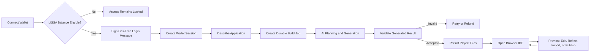
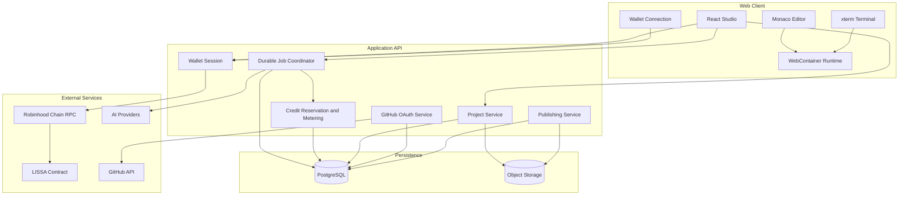
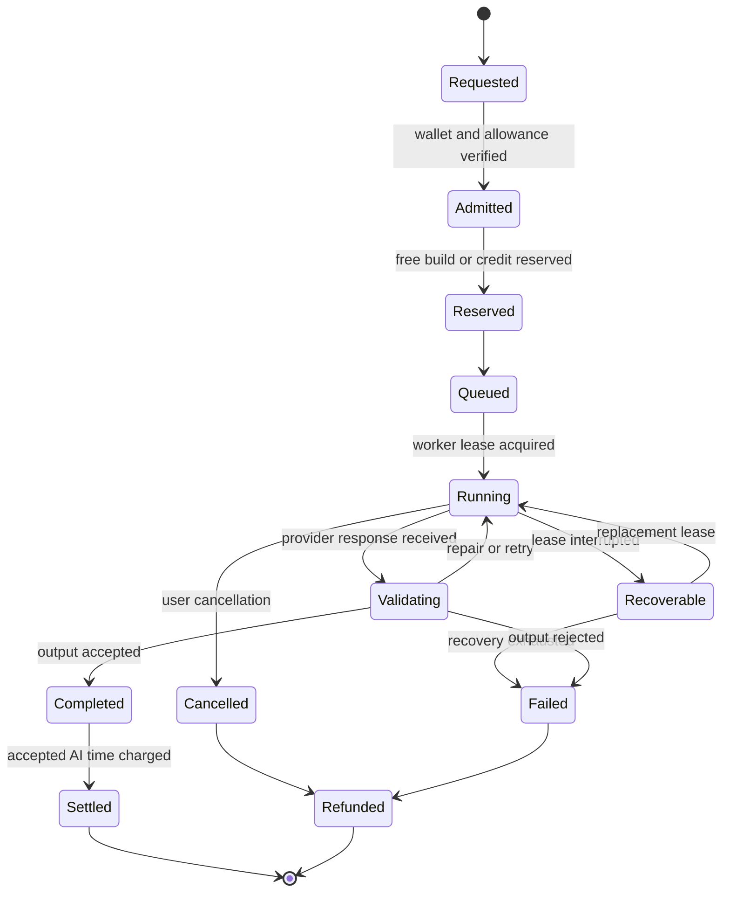
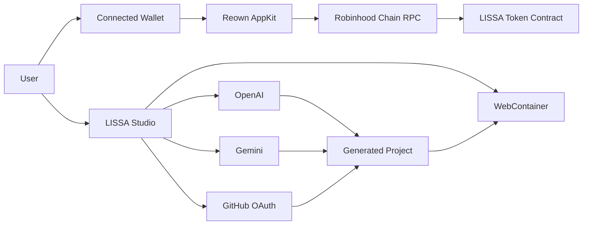
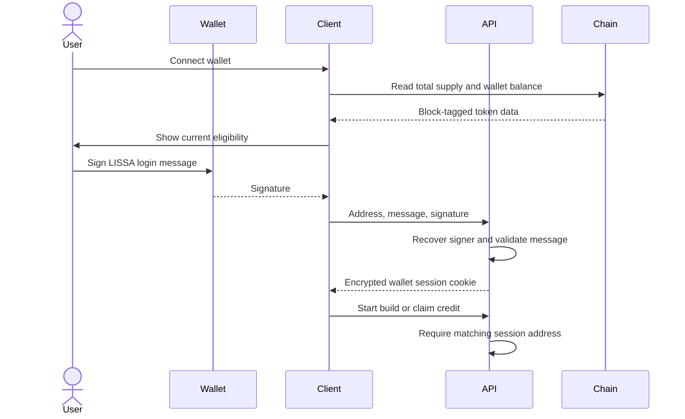
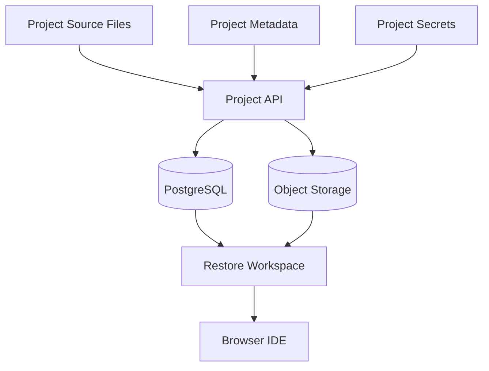

<div align="center">
  

  <h3>AI Application Builder for LISSA Holders</h3>

  <p>
    Describe an idea, generate a complete application, edit its source code,
    run it inside the browser, connect a repository, and publish it from one workspace.
  </p>

  <p>
    <a href="#overview">Overview</a> ·
    <a href="#features">Features</a> ·
    <a href="#architecture">Architecture</a> ·
    <a href="#integrations">Integrations</a> ·
    <a href="#getting-started">Getting Started</a> ·
    <a href="#security">Security</a>
  </p>

  <p>
    
    
    
    
    
  </p>
</div>

---

## Table of Contents

- [Overview](#overview)
- [Why LISSA](#why-lissa)
- [Features](#features)
- [How It Works](#how-it-works)
- [Architecture](#architecture)
- [Build Lifecycle](#build-lifecycle)
- [Integrations](#integrations)
- [Wallet and Token Access](#wallet-and-token-access)
- [Build Credit Economy](#build-credit-economy)
- [Browser IDE](#browser-ide)
- [GitHub Integration](#github-integration)
- [Project Persistence](#project-persistence)
- [Security](#security)
- [Technology Stack](#technology-stack)
- [Repository Structure](#repository-structure)
- [Getting Started](#getting-started)
- [Environment Variables](#environment-variables)
- [Development Commands](#development-commands)
- [API Reference](#api-reference)
- [Testing](#testing)
- [Production Checklist](#production-checklist)
- [Troubleshooting](#troubleshooting)
- [Contributing](#contributing)
- [License](#license)

---

## Overview

**LISSA** is an autonomous AI application builder created exclusively for verified LISSA token holders. It combines natural-language generation, asynchronous AI jobs, an editable browser IDE, a terminal, live application previews, project persistence, GitHub imports, and publishing into one continuous workflow.

Instead of stopping at a static code response, LISSA turns a product brief into a working development environment:

1. The user connects an eligible wallet.
2. Wallet ownership is verified with a gas-free signed message.
3. The user describes the application in natural language.
4. LISSA plans the architecture and generates editable source files.
5. The generated project opens in an isolated browser runtime.
6. The user can inspect, run, edit, refine, save, import, or publish the project.

LISSA is designed around **transparent autonomous work**. Build status comes from durable backend events, allowing long-running jobs to survive reloads and recover safely after interrupted workers.

---

## Why LISSA

Traditional AI coding chats often leave the user with disconnected snippets, hidden execution state, and no persistent workspace. LISSA provides the complete build loop:

| Capability | What LISSA Provides |
|---|---|
| Product planning | Converts a product brief into an implementation plan |
| Source generation | Produces structured, editable project files |
| Refinement | Applies follow-up changes to the existing project |
| Live runtime | Runs supported projects in an isolated browser environment |
| Code editing | Provides a Monaco-powered source editor |
| Terminal | Exposes the project runtime through an integrated terminal |
| Persistence | Stores projects so work can continue across sessions |
| Repository import | Imports public GitHub repositories using wallet-bound OAuth |
| Publishing | Produces a public project build from the saved source |
| Holder utility | Grants access and continuously accruing build credit to LISSA holders |

---

## Features

### AI Application Generation

- Generate interfaces, dashboards, tools, and complete applications from natural-language prompts.
- Attach code, text, JSON, CSV, HTML, CSS, JavaScript, and TypeScript context.
- Preserve the generated project as structured files rather than a single code block.
- Request follow-up changes without rebuilding the entire project manually.
- Validate provider output before accepting and billing a build result.

### Durable Agent Jobs

- Persist build jobs and progress events on the server.
- Resume status polling after browser reloads.
- Recover abandoned worker leases without creating duplicate charges.
- Cancel an active build from the client.
- Refund reserved allowance or credit on terminal failure.
- Prevent concurrent jobs from spending the same credit balance.

### Complete Studio Workspace

- **Agent** — request generation and focused refinements.
- **Preview** — inspect the running application.
- **Code** — edit files with Monaco Editor.
- **Terminal** — run package commands and inspect project output.
- **Data** — review project records and project state.
- **Deployments** — view publication status and public builds.
- **Tools** — access connected capabilities.

### Project Management

- Create and restore persistent projects.
- Save source files and project metadata.
- Store project-specific secret names and values separately from source code.
- Browse recent projects and published builds.
- Import an existing public GitHub repository.
- Keep each GitHub authorization isolated to the authenticated wallet.

### Responsive Interface

- Desktop workspace optimized for side-by-side building.
- Mobile layouts that preserve navigation and credit management.
- No dependency on synthetic progress timers.
- Accessible labels, keyboard-focus states, and responsive panels.

---

## How It Works



---

## Architecture

LISSA uses a typed multi-package architecture with a React client, an Express API, PostgreSQL persistence, shared API contracts, and an isolated browser runtime.



### Design Principles

1. **Durable before interactive** — the server persists job state before the client displays progress.
2. **Wallet-bound authorization** — protected operations require an authenticated wallet session.
3. **Accepted work only** — paid usage is committed only after the provider response passes application validation.
4. **Browser isolation** — imported applications run inside an isolated runtime rather than the LISSA application origin.
5. **Shared contracts** — OpenAPI, generated schemas, and runtime validation keep the client and server aligned.
6. **Explicit failure** — failed generation, invalid output, and expired leases produce terminal states instead of silent fallbacks.

---

## Build Lifecycle



### Metered and Free Activity

| Activity | Credit Usage |
|---|---:|
| First two daily builds | Free |
| Accepted initial AI generation | `$0.30 / minute` |
| Accepted AI refinement | `$0.30 / minute` |
| Queue time | Free |
| Transport retry and backoff | Free |
| Framework validation and repair attempts | Free |
| Invalid or truncated provider output | Free |
| Failed or cancelled jobs | Refunded |
| Manual file editing | Free |
| Browser runtime and terminal | Free |
| Project browsing and saving | Free |

---

## Integrations

<table>
  <thead>
    <tr>
      <th align="center">Logo</th>
      <th>Integration</th>
      <th>Purpose</th>
    </tr>
  </thead>
  <tbody>
    <tr>
      <td align="center"></td>
      <td><strong>Robinhood Chain</strong></td>
      <td>Reads LISSA balances, total supply, network identity, and holder eligibility.</td>
    </tr>
    <tr>
      <td align="center"></td>
      <td><strong>Reown AppKit / WalletConnect</strong></td>
      <td>Connects compatible wallets and coordinates chain switching.</td>
    </tr>
    <tr>
      <td align="center"></td>
      <td><strong>Coinbase Wallet</strong></td>
      <td>Provides a supported wallet connection path for holder authentication.</td>
    </tr>
    <tr>
      <td align="center"></td>
      <td><strong>GitHub OAuth</strong></td>
      <td>Lists and imports public repositories through wallet-isolated user sessions.</td>
    </tr>
    <tr>
      <td align="center"></td>
      <td><strong>OpenAI</strong></td>
      <td>Provides architecture planning, source generation, refinement, and validation models.</td>
    </tr>
    <tr>
      <td align="center"></td>
      <td><strong>Google Gemini</strong></td>
      <td>Provides image-generation capabilities for supported visual build flows.</td>
    </tr>
    <tr>
      <td align="center"></td>
      <td><strong>WebContainers</strong></td>
      <td>Runs generated projects, package commands, and terminal sessions inside the browser.</td>
    </tr>
    <tr>
      <td align="center"></td>
      <td><strong>PostgreSQL</strong></td>
      <td>Persists projects, jobs, progress events, credit accounts, leases, and encrypted sessions.</td>
    </tr>
    <tr>
      <td align="center"></td>
      <td><strong>Object Storage</strong></td>
      <td>Stores durable project and publication assets outside the relational database.</td>
    </tr>
  </tbody>
</table>

### Integration Flow



---

## Wallet and Token Access

LISSA verifies both token eligibility and wallet ownership.

| Network Property | Value |
|---|---|
| Network | Robinhood Chain |
| Chain ID | `4663` |
| Token | `LISSA` |
| Token contract | `0x23D1BF831469305488902070066aa3966f011617` |
| Minimum holding | `0.1%` of current total supply |
| Authentication transaction | None |
| Authentication gas cost | None |

### Authentication Sequence



Balance and total supply observations are read from the same chain block. Stored block watermarks prevent a delayed older observation from replacing a newer eligibility checkpoint.

---

## Build Credit Economy

Every wallet receives:

- **Two free builds per calendar day**
- **Continuously accruing credit** while the wallet remains eligible
- **Proportional earnings** for holdings above the minimum threshold

### Earning Rate

A wallet holding `0.1%` of current LISSA supply earns:

```text
$1.30 per hour
```

Larger balances earn proportionally:

```text
hourly credit = wallet share of supply × 1000 × $1.30
```

Claimable credit updates continuously and can be claimed whenever the amount is greater than zero.

### Usage Rate

After the two free daily builds:

```text
$0.30 per minute of accepted active AI generation or refinement
```

Paid jobs reserve available credit atomically before work begins. Successful jobs charge only accepted provider intervals and return unused escrow. Failure and cancellation restore the reservation exactly once.

---

## Browser IDE

<table>
  <tr>
    <td align="center" width="25%">
      <br />
      <strong>Monaco Editor</strong><br />
      Syntax highlighting and editable project files
    </td>
    <td align="center" width="25%">
      <br />
      <strong>Terminal</strong><br />
      Interactive package and debugging commands
    </td>
    <td align="center" width="25%">
      <br />
      <strong>Web Runtime</strong><br />
      Isolated in-browser project execution
    </td>
    <td align="center" width="25%">
      <br />
      <strong>Live Preview</strong><br />
      Immediate visual feedback from the running app
    </td>
  </tr>
</table>

The browser runtime keeps generated or imported applications separated from the LISSA application origin. Project previews do not execute as trusted application HTML.

---

## GitHub Integration

GitHub access belongs to the currently authenticated wallet session.

### Supported Flow

1. Sign in with an eligible LISSA wallet.
2. Start GitHub OAuth from the project browser or IDE.
3. Approve access for the current GitHub account.
4. List repositories available to that session.
5. Import a public repository into a new LISSA project.
6. Run, inspect, and refine the imported source in the browser IDE.

### Isolation Rules

- GitHub credentials are encrypted before persistence.
- OAuth state is protected against forgery and replay.
- A GitHub session is bound to the authenticated wallet.
- One wallet cannot use another wallet's GitHub authorization.
- Repository content is fetched on demand rather than served from a shared repository cache.
- Imported HTML never executes on the trusted LISSA origin.
- The integration is intentionally limited to public-repository workflows.

---

## Project Persistence



Persisted data includes:

- Project identity and metadata
- Generated and imported source files
- Build job state
- Agent progress events
- Worker lease state
- Wallet credit account state
- Holder accrual checkpoints
- Publication metadata
- Encrypted external authorization records

Project secret values are managed through dedicated API routes and should never be committed to the repository.

---

## Security

### Wallet Security

- Uses signed-message verification to prove wallet ownership.
- Rejects protected operations when the session address does not match the requested wallet.
- Scopes the encrypted wallet cookie to API routes.
- Does not require an on-chain authentication transaction.

### Job Security

- Public requests cannot invoke the internal generation endpoint.
- Internal worker requests require loopback access, active job context, a valid lease, and an unguessable worker credential.
- Worker lease credentials are never exposed through public progress events.
- Cancellation and lease expiry terminate active internal work.

### Credit Security

- Credit reservation is atomic.
- Concurrent jobs cannot reserve the same balance.
- Settlement is idempotent.
- Failure and cancellation refund escrow exactly once.
- Free-build refunds only modify the original reservation day.
- Older chain observations cannot overwrite newer holder checkpoints.

### GitHub Security

- OAuth state is sealed and validated.
- Stored authorization is encrypted.
- Repository access is wallet-isolated.
- Malformed, legacy, or forged session data is rejected.
- Imported applications remain sandboxed from privileged application context.

### Secret Handling

Never commit:

- `.env` files
- Provider API keys
- OAuth client secrets
- Session encryption secrets
- Database connection strings
- Object-storage credentials

Use a dedicated secret manager in development and production.

---

## Technology Stack

### Frontend

<p>
  
  &nbsp;
  
  &nbsp;
  
  &nbsp;
  
  &nbsp;
  
  &nbsp;
  
</p>

- React
- TypeScript
- Vite
- Tailwind CSS
- TanStack Query
- Wouter
- Radix UI
- Framer Motion
- Monaco Editor
- xterm.js
- WebContainer API
- Wagmi, Viem, and Reown AppKit

### Backend

<p>
  
  &nbsp;
  
  &nbsp;
  
  &nbsp;
  
  &nbsp;
  
</p>

- Node.js
- Express
- TypeScript
- PostgreSQL
- Drizzle ORM
- OpenAPI and generated Zod contracts
- Pino structured logging
- Google Cloud Storage client

### AI and Web3

- OpenAI generation and validation models
- Gemini image generation
- Robinhood Chain JSON-RPC
- ERC-20 balance and total-supply reads
- WalletConnect-compatible wallet sessions
- Signed wallet authentication

---

## Repository Structure

```text
.
├── artifacts/
│   ├── ai-studio-applet/          # React client and browser IDE
│   │   ├── public/                # Public brand assets
│   │   └── src/
│   │       ├── components/        # Studio, access, editor, and project UI
│   │       ├── data/              # In-app documentation and content
│   │       ├── hooks/             # Client behavior and data hooks
│   │       ├── lib/               # Wallet, runtime, OAuth, and utilities
│   │       └── pages/             # Application routes
│   └── api-server/                # Express API and asynchronous workers
│       ├── src/
│       │   ├── lib/               # Credit calculations and shared services
│       │   └── routes/            # Jobs, credits, GitHub, projects, health
│       └── test/                  # Integration and regression tests
├── lib/
│   ├── api-client-react/          # Generated React API client
│   ├── api-spec/                  # OpenAPI specification
│   ├── api-zod/                   # Generated runtime validation schemas
│   ├── db/                        # Database client and Drizzle schemas
│   └── integrations-gemini-ai/    # Gemini text/image client utilities
├── scripts/                       # Workspace utilities
├── package.json                   # Root commands
├── pnpm-workspace.yaml            # Workspace and dependency catalog
└── tsconfig.json                  # TypeScript project references
```

---

## Getting Started

### Prerequisites

- Node.js 20 or newer
- pnpm 10 or newer
- PostgreSQL database
- An OpenAI API key
- Gemini-compatible API credentials for image generation
- GitHub OAuth application credentials
- Reown project ID
- Object-storage bucket
- Robinhood Chain RPC access

### 1. Clone the Repository

```bash
git clone <repository-url>
cd <repository-directory>
```

### 2. Install Dependencies

```bash
pnpm install
```

This repository intentionally requires pnpm. npm and Yarn lockfiles are not supported.

### 3. Configure Environment Variables

Create local secret values using your preferred environment or secret manager. Do not commit them to source control.

### 4. Prepare the Database

Configure `DATABASE_URL`, then apply the schema using the database migration workflow used by your environment.

The database must include the current project, build-job, credit-account, lease, and holder-checkpoint columns before the API starts accepting paid jobs.

### 5. Start the API

```bash
pnpm --filter @workspace/api-server run dev
```

### 6. Start the Web Client

In a second terminal:

```bash
pnpm --filter @workspace/ai-studio-applet run dev
```

### 7. Verify Health

```bash
curl http://localhost:<api-port>/api/healthz
```

---

## Environment Variables

### Required Server Variables

| Variable | Required | Description |
|---|:---:|---|
| `DATABASE_URL` | Yes | PostgreSQL connection string |
| `OPENAI_API_KEY` | Yes | OpenAI provider credential |
| `SESSION_SECRET` | Yes | Strong secret used to protect application sessions |
| `GITHUB_CLIENT_ID` | For GitHub | GitHub OAuth application client ID |
| `GITHUB_CLIENT_SECRET` | For GitHub | GitHub OAuth application client secret |
| `GITHUB_REDIRECT_URI` | For GitHub | Absolute OAuth callback URL |
| `PUBLIC_APP_URL` | Production | Canonical public application URL |
| `DEFAULT_OBJECT_STORAGE_BUCKET_ID` | For storage | Bucket identifier for persistent assets |
| `AI_INTEGRATIONS_GEMINI_BASE_URL` | For images | Gemini-compatible API base URL |
| `AI_INTEGRATIONS_GEMINI_API_KEY` | For images | Gemini-compatible API credential |

### Runtime Variables

| Variable | Default | Description |
|---|---|---|
| `PORT` | Environment-defined | API listening port |
| `NODE_ENV` | `development` | Runtime mode |
| `LOG_LEVEL` | `info` | Structured server log level |
| `BASE_PATH` | `/` | Optional application base path |

### Client Variables

| Variable | Required | Description |
|---|:---:|---|
| `VITE_REOWN_PROJECT_ID` | Yes | Reown AppKit project identifier |

> Never expose server credentials through `VITE_` variables. Values prefixed with `VITE_` are bundled into client code.

---

## Development Commands

| Command | Purpose |
|---|---|
| `pnpm install` | Install workspace dependencies |
| `pnpm run typecheck` | Type-check libraries, applications, and scripts |
| `pnpm run build` | Type-check and build all packages |
| `pnpm --filter @workspace/ai-studio-applet run dev` | Start the client development server |
| `pnpm --filter @workspace/ai-studio-applet run build` | Build the production client |
| `pnpm --filter @workspace/api-server run dev` | Build and start the development API |
| `pnpm --filter @workspace/api-server run build` | Build the production API bundle |
| `pnpm --filter @workspace/api-server run typecheck` | Type-check the API |
| `pnpm --filter @workspace/api-server run test:agent` | Run agent job regression tests |

---

## API Reference

All application routes are served under `/api`.

### Health

| Method | Path | Description |
|---|---|---|
| `GET` | `/api/healthz` | Service health check |

### Wallet Session

| Method | Path | Description |
|---|---|---|
| `POST` | `/api/wallet/session` | Verify a signed login message and establish the wallet session |

### Build Jobs

| Method | Path | Description |
|---|---|---|
| `POST` | `/api/build/jobs` | Admit and create a durable build job |
| `GET` | `/api/build/jobs/status` | Read the current job status |
| `GET` | `/api/build/jobs/events` | Read persisted progress events |
| `POST` | `/api/build/jobs/cancel` | Cancel an active job |
| `POST` | `/api/build/jobs/runtime/events` | Record authenticated runtime events |
| `POST` | `/api/build/jobs/runtime/report` | Submit authenticated runtime reports |

The internal `/api/build` execution route is intentionally unavailable to public callers.

### Credits

| Method | Path | Description |
|---|---|---|
| `GET` | `/api/credits/status` | Read free builds, balance, rate, and claimable credit |
| `POST` | `/api/credits/claim` | Transfer positive claimable holder credit into the usage balance |

### Projects

| Method | Path | Description |
|---|---|---|
| `GET` | `/api/projects` | List persisted projects |
| `GET` | `/api/projects/:id` | Read one project |
| `PUT` | `/api/projects/:id` | Create or update project state |
| `GET` | `/api/projects/:id/secrets` | List project secret metadata |
| `PUT` | `/api/projects/:id/secrets` | Create or update project secrets |
| `DELETE` | `/api/projects/:id/secrets/:key` | Delete a project secret |
| `POST` | `/api/projects/:id/publish` | Publish a saved project |
| `GET` | `/api/published/:id/*` | Serve a published project asset |

### GitHub

| Method | Path | Description |
|---|---|---|
| `POST` | `/api/github/oauth/start` | Begin wallet-bound OAuth |
| `GET` | `/api/github/oauth/callback` | Validate OAuth state and complete connection |
| `GET` | `/api/github/status` | Read connection status |
| `POST` | `/api/github/disconnect` | Remove the current wallet's GitHub connection |
| `GET` | `/api/github/repos` | List repositories for the current session |
| `GET` | `/api/github/import/:owner/:repo` | Import a public repository |

The OpenAPI source of truth is located at:

```text
lib/api-spec/openapi.yaml
```

Generated client and validation contracts live in:

```text
lib/api-client-react/
lib/api-zod/
```

---

## Testing

The API regression suite covers critical accounting, authentication, worker, and isolation guarantees.

```bash
pnpm --filter @workspace/api-server run test:agent
```

Coverage includes:

- Exact successful-job settlement
- Provider retry timing
- Broken and delayed response bodies
- Invalid result validation
- Concurrent paid admission
- Double-spend prevention
- Cancellation and settlement races
- Lease expiry and worker recovery
- Legacy paid-job compatibility
- Daily free-build accounting
- Cross-day refund behavior
- Wallet impersonation rejection
- Internal worker credential protection
- Holder checkpoint block ordering
- Proportional holder accrual
- GitHub wallet isolation
- OAuth state validation
- Browser sandbox boundaries

Run the complete static and production checks with:

```bash
pnpm run typecheck
pnpm run build
```

---

## Production Checklist

Before publishing a production release:

- [ ] Apply the latest database schema to the production database.
- [ ] Configure a strong `SESSION_SECRET`.
- [ ] Configure provider credentials through a secret manager.
- [ ] Configure the canonical `PUBLIC_APP_URL`.
- [ ] Register the exact production GitHub OAuth callback URL.
- [ ] Configure `VITE_REOWN_PROJECT_ID`.
- [ ] Verify Robinhood Chain RPC connectivity.
- [ ] Confirm the LISSA token contract and Chain ID.
- [ ] Confirm object-storage access and bucket permissions.
- [ ] Run API regression tests.
- [ ] Run the complete type-check.
- [ ] Build both the API and web client.
- [ ] Verify desktop and mobile wallet connection.
- [ ] Verify Coinbase Wallet and other AppKit wallet popups.
- [ ] Test one free build and one paid build.
- [ ] Interrupt and recover an active worker.
- [ ] Cancel an active paid job and confirm exact refund.
- [ ] Verify GitHub OAuth with two separate wallets.
- [ ] Confirm imported applications cannot access privileged application context.
- [ ] Review logs for secrets or worker credentials before launch.

---

## Troubleshooting

### Wallet connects but access remains locked

1. Confirm the wallet is connected to Chain ID `4663`.
2. Confirm the wallet holds at least `0.1%` of the current LISSA total supply.
3. Refresh the live balance reading.
4. Sign the gas-free authentication message again.
5. Verify the configured RPC can read the token contract.

### Wallet popup does not open

1. Confirm `VITE_REOWN_PROJECT_ID` is present in the client environment.
2. Check that the application origin is allowed in the Reown project.
3. Disable popup blocking for the application domain.
4. Verify the wallet extension is unlocked.
5. Test both injected and QR-based connection methods.

### A build appears stuck

1. Read `/api/build/jobs/status`.
2. Inspect `/api/build/jobs/events`.
3. Confirm the API worker is running.
4. Check whether the current lease has expired.
5. Avoid creating a replacement job manually; the durable recovery path should resume or terminate the original job.

### Credit balance does not update

1. Confirm the wallet session matches the displayed address.
2. Check `/api/credits/status`.
3. Verify the chain RPC returned balance and supply at a valid block.
4. Confirm the wallet remains above the current holder threshold.
5. Check for a newer stored block watermark.

### GitHub import redirects to authorization repeatedly

1. Confirm the LISSA wallet session is active.
2. Verify the OAuth callback URL matches `GITHUB_REDIRECT_URI`.
3. Confirm cookies are accepted for the application origin.
4. Disconnect and reconnect the current wallet's GitHub session.
5. Ensure the requested repository is public.

### Browser preview does not start

1. Confirm the browser supports WebContainers.
2. Check cross-origin isolation requirements.
3. Inspect the integrated terminal for package installation errors.
4. Confirm the generated project has a supported start command.
5. Reload the project from persisted source before regenerating it.

---

## Contributing

Contributions should preserve LISSA's core guarantees:

1. Keep wallet-protected actions bound to the authenticated signer.
2. Never expose internal worker credentials through public APIs or events.
3. Bill only accepted active provider intervals.
4. Keep failure and cancellation settlement idempotent.
5. Keep imported code isolated from privileged application context.
6. Update OpenAPI and generated contracts together.
7. Add regression coverage for accounting, authentication, or lease changes.
8. Run type-checks and production builds before opening a pull request.

### Suggested Contribution Workflow

```bash
git checkout -b feature/your-change
pnpm install
pnpm run typecheck
pnpm --filter @workspace/api-server run test:agent
pnpm run build
git commit -m "feat: describe your change"
git push origin feature/your-change
```

---

## License

This project is licensed under the MIT License.

---

<div align="center">
  
  <p><strong>LISSA</strong></p>
  <p>From natural-language intent to a running, editable application.</p>
</div>
